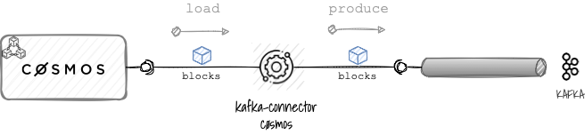

# CØSMOS Kafka Connector

> Kafka Connect connector for CØSMOS based blockchains.

[](https://github.com/okp4/kafka-connector-cosmos/releases)
[](https://github.com/okp4/kafka-connector-cosmos/actions/workflows/build.yml)
[](https://github.com/okp4/kafka-connector-cosmos/actions/workflows/lint.yml)
[](https://github.com/okp4/kafka-connector-cosmos/actions/workflows/test.yml)
[](https://ktlint.github.io/)
[](https://conventionalcommits.org)
[](https://github.com/okp4/.github/blob/main/CODE_OF_CONDUCT.md)
[](https://opensource.org/licenses/BSD-3-Clause)

## Purpose

The Kafka Connect CØSMOS Source connector is
a [Kafka connector](https://docs.confluent.io/platform/current/connect/concepts.html#connect-connectors)
used to move [blocks](https://docs.cosmos.network/master/intro/sdk-app-architecture.html) from a Cosmos blockchain (in
priority the [økp4 chain](https://github.com/okp4/okp4d)) into an Apache Kafka® topic.

<p align="center">
  
</p>

The connector can be used when there is a need for connecting CØSMOS blockchains with Kafka in order to build a real-time
data pipelines based on blocks.

## Build

### Prerequsites

To build the project, you will need the following dependencies:

- [Java 11+](https://openjdk.java.net/)

## Building

This project relies on the [Gradle](https://gradle.org/) build system.

If you are on windows then open a command line, go into the root directory and run:

```sh
.\gradlew build
```

If you are on linux/mac then open a terminal, go into the root directory and run:

```sh
./gradlew build
```
